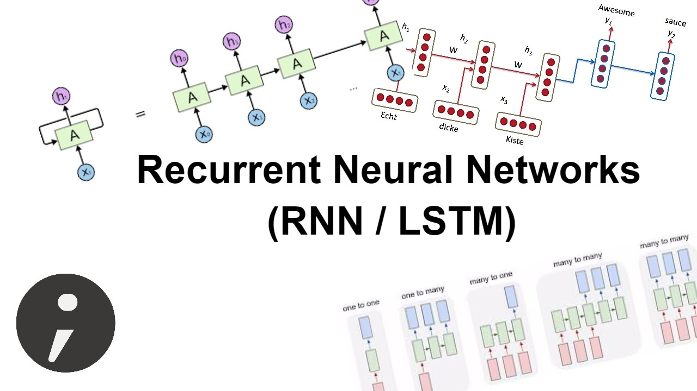
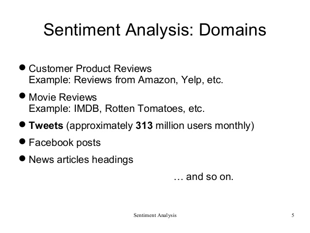
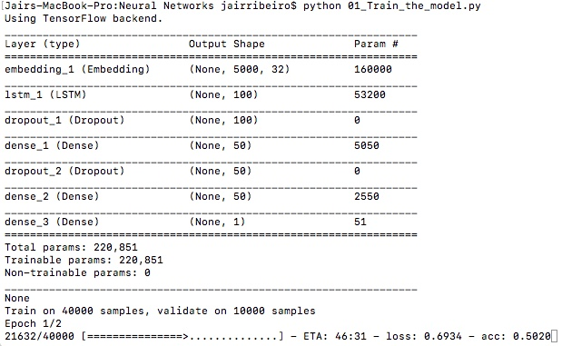
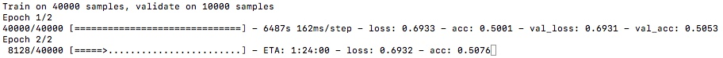
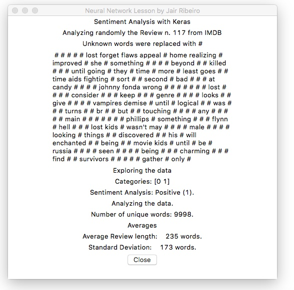
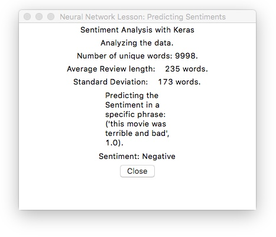

# SentimentAnalysisRNN-miniguide

A step by step mini-guide about how your first RNN and use it for Sentiment Analysis

# Purpose

The purpose of this tutorial is to help anybody write their first RNN LSTM model without much background in Artificial Neural Networks or Machine Learning. The discussion is not centered on the theory or working of such networks but on writing code for solving a particular problem. We will understand how neural networks let us solve some problems effortlessly, and how they can be applied to a multitude of other problems.

# Intro
Sentiment analysis probably is one the most common applications in Natural Language processing.  In this step-by-step training, we will build a classifier movie reviews in IMDB data set, using Recurrent Neural Networks. If you want to dive deeper on deep learning for sentiment analysis, this is a good first step.

We will use Recurrent Neural Networks, and in particular LSTMs, to perform sentiment analysis in Keras. Conveniently, Keras has a built-in IMDb movie reviews data set that we can use.

Let me walk you through all of the steps needed to make a well working sentiment detection with Keras and long short-term memory networks. Keras is a very popular python deep learning library, similar to TFlearn that allows to create neural networks without writing too much boiler plate code. LSTM networks are a special form or network architecture especially useful for text tasks which I am going to explain later. 

# What is Keras?

Keras is an open source python library that enables you to easily build Neural Networks. The library is capable of running on top of TensorFlow, Microsoft Cognitive Toolkit, Theano, and MXNet. Tensorflow and Theano are the most used numerical platforms in Python to build Deep Learning algorithms but they can be quite complex and difficult to use. In comparison, Keras provides an easy and convenient way to build deep learning models. It’s creator François Chollet developed it to enable people to build Neural Networks as fast and easy as possible. He laid his focus on extensibility, modularity, minimalism and the support of python. Keras can be used with GPUs and CPUs and it supports both Python 2 and 3. 

Google Keras made a big contribution to the commoditization of deep learning and artificial intelligence since it has commoditized powerful, modern Deep Learning algorithms that previously were not only inaccessible but also unusable as well.
What is Sentiment Analysis?

# What are RNNs?

Simple multi-layered neural networks are classifiers which when given a certain input, tag the input as belonging to one of the many classes. They are trained using the existing backpropagation algorithms. These networks are great at what they do but they are not capable of handling inputs which come in a sequence. For example, for a neural net to identify the nouns in a sentence, having just the word as input is not helpful at all. A lot of information is present in the context of the word which can only be determined by looking at the words near the given word. The entire sequence is to be studied to determine the output. This is where Recurrent Neural Networks (RNNs) find their use. As the RNN traverses the input sequence, output for every input also becomes a part of the input for the next item of the sequence. 

You can read more about the utility of RNNs in Andrej Karpathy’s brilliant blog post. (http://karpathy.github.io/2015/05/21/rnn-effectiveness/). 

It is helpful to note the ‘recurrent’ property of the network, where the previous output for an input item becomes a part of the current input which comprises the current item in the sequence and the last output. When done over and over, the last output would be the result of all the previous inputs and the last input.

# What is Sentiment Analysis

Sentiment analysis is a natural language processing problem where text is understood and the underlying intent is predicted.

With Sentiment Analysis, we want to determine the attitude (e.g the sentiment) of for example a speaker or writer with respect to a document, interaction, or event. Therefore it is a natural language processing problem where text needs to be understood, to predict the underlying intent. The sentiment is mostly categorized into positive, negative and neutral categories. With the use of Sentiment Analysis, we want to predict for example a customers opinion and attitude about a product based on a review he wrote about it. Because of that, Sentiment Analysis is widely applied to things like reviews, surveys, documents and much more.

# The imdb Dataset

This dataset contains the movie reviews from IMDb along with their associated binary sentiment polarity labels.

The imdb sentiment classification dataset consists of 50,000 movie reviews from imdb users that are labeled as either positive (1) or negative (0). The reviews are preprocessed and each one is encoded as a sequence of word indexes in the form of integers. The words within the reviews are indexed by their overall frequency within the dataset. For example, the integer “2” encodes the second most frequent word in the data. The 50,000 reviews are split into 25,000 for training and 25,000 for testing. 

The dataset was created by researchers of the Stanford University and published in a paper in 2011, where they achieved 88.89% accuracy. It was also used within the “Bag of Words Meets Bags of Popcorn” Kaggle competition in 2011.

You can use any method to classify the test data.

Below is the original dataset we used for this competition. 

http://ai.stanford.edu/~amaas/data/sentiment/

## 1 - Importing the Dependencies and getting the Data - 01_Train_the_model.py

Fortunately Keras provides access to the IMDB dataset built-in. The IMDB sample comes already with the Keras datasets library, so you don't have to download anything.

The keras.datasets.imdb.load_data() allows you to load the dataset in a format that is ready for use in neural network and deep learning models.

The words have been replaced by integers that indicate the absolute popularity of the word in the dataset. The sentences in each review are therefore comprised of a sequence of integers.

Calling imdb.load_data() the first time will download the IMDB dataset to your computer and store it in your home directory under ~/.keras/datasets/imdb.pkl as a 32 megabyte file.

Usefully, the imdb.load_data() provides additional arguments including the number of top words to load (where words with a lower integer are marked as zero in the returned data), the number of top words to skip (to avoid the “the”‘s) and the maximum length of reviews to support.

Let’s load the dataset and calculate some properties of it. We will start off by loading some libraries and loading the entire IMDB dataset as a training dataset.

We start by importing the required dependencies to preprocess our data and to build our model.

%matplotlib inline
import matplotlib
import matplotlib.pyplot as plt

import numpy as np
from keras.utils import to_categorical
from keras import models
from keras import layers

We continue with downloading the imdb dataset, which is fortunately already built into Keras. Since we don’t want to have a 50/50 train test split, we will immediately merge the data into data and targets after downloading, so that we can do an 80/20 split later on.

from keras.datasets import imdb
(training_data, training_targets), (testing_data, testing_targets) = imdb.load_data(num_words=10000)
data = np.concatenate((training_data, testing_data), axis=0)
targets = np.concatenate((training_targets, testing_targets), axis=0)

## 2 - Exploring the Data

Now we can start exploring the dataset:

print("Categories:", np.unique(targets))
print("Number of unique words:", len(np.unique(np.hstack(data))))

Categories: [0 1]
Number of unique words: 9998

length = [len(i) for i in data]
print("Average Review length:", np.mean(length))
print("Standard Deviation:", round(np.std(length)))

Average Review length: 234.75892
Standard Deviation: 173.0

You can see in the output above that the dataset is labeled into two categories, either 0 or 1, which represents the sentiment of the review. The whole dataset contains 9998 unique words and the average review length is 234 words, with a standard deviation of 173 words.

If you look at the data you will realize it has been already pre-processed. All words have been mapped to integers and the integers represent the words sorted by their frequency. This is very common in text analysis to represent a dataset like this. So 4 represents the 4th most used word, 5 the 5th most used word and so on... The integer 1 is reserved for the start marker, the integer 2 for an unknown word and 0 for padding. 

Now we will look at a single training example:

print("Label:", targets[0])

Label: 1

print(data[0])

[1, 14, 22, 16, 43, 530, 973, 1622, 1385, 65, 458, 4468, 66, 3941, 4, 173, 36, 256, 5, 25, 100, 43, 838, 112, 50, 670, 2, 9, 35, 480, 284, 5, 150, 4, 172, 112, 167, 2, 336, 385, 39, 4, 172, 4536, 1111, 17, 546, 38, 13, 447, 4, 192, 50, 16, 6, 147, 2025, 19, 14, 22, 4, 1920, 4613, 469, 4, 22, 71, 87, 12, 16, 43, 530, 38, 76, 15, 13, 1247, 4, 22, 17, 515, 17, 12, 16, 626, 18, 2, 5, 62, 386, 12, 8, 316, 8, 106, 5, 4, 2223, 5244, 16, 480, 66, 3785, 33, 4, 130, 12, 16, 38, 619, 5, 25, 124, 51, 36, 135, 48, 25, 1415, 33, 6, 22, 12, 215, 28, 77, 52, 5, 14, 407, 16, 82, 2, 8, 4, 107, 117, 5952, 15, 256, 4, 2, 7, 3766, 5, 723, 36, 71, 43, 530, 476, 26, 400, 317, 46, 7, 4, 2, 1029, 13, 104, 88, 4, 381, 15, 297, 98, 32, 2071, 56, 26, 141, 6, 194, 7486, 18, 4, 226, 22, 21, 134, 476, 26, 480, 5, 144, 30, 5535, 18, 51, 36, 28, 224, 92, 25, 104, 4, 226, 65, 16, 38, 1334, 88, 12, 16, 283, 5, 16, 4472, 113, 103, 32, 15, 16, 5345, 19, 178, 32]

Above you see the first review of the dataset which is labeled as positive (1). The code below retrieves the dictionary mapping word indices back into the original words so that we can read them. It replaces every unknown word with a “#”. It does this by using the get_word_index() function.

If you want to peek at the reviews yourself and see what people have actually written, you can reverse the process too:

index = imdb.get_word_index()
reverse_index = dict([(value, key) for (key, value) in index.items()]) 
decoded = " ".join( [reverse_index.get(i - 3, "#") for i in data[0]] )
print(decoded) 

this film was just brilliant casting location scenery story direction everyone's really suited the part they played and you could just imagine being there robert # is an amazing actor and now the same being director # father came from the same scottish island as myself so i loved the fact there was a real connection with this film the witty remarks throughout the film were great it was just brilliant so much that i bought the film as soon as it was released for # and would recommend it to everyone to watch and the fly fishing was amazing really cried at the end it was so sad and you know what they say if you cry at a film it must have been good and this definitely was also # to the two little boy's that played the # of norman and paul they were just brilliant children are often left out of the # list i think because the stars that play them all grown up are such a big profile for the whole film but these children are amazing and should be praised for what they have done don't you think the whole story was so lovely because it was true and was someone's life after all that was shared with us all

# Preparing the data

Now it is time to prepare our data. We will vectorize every review and fill it with zeros so that it contains exactly 10,000 numbers. That means we fill every review that is shorter than 10,000 with zeros. We do this because the biggest review is nearly that long and every input for our neural network needs to have the same size. We also transform the targets into floats.

def vectorize(sequences, dimension = 10000):
results = np.zeros((len(sequences), dimension))
for i, sequence in enumerate(sequences):
results[i, sequence] = 1
return results
 
data = vectorize(data)
targets = np.array(targets).astype("float32")

Now we split our data into a training and a testing set. The training set will contain 40,000 reviews and the testing set 10,000.

test_x = data[:10000]
test_y = targets[:10000]

train_x = data[10000:]
train_y = targets[10000:]

# Building and Training the Model

We can now build our simple Neural Network. We start by defining the type of model we want to build. There are two types of models available in Keras: the Sequential model and the Model class used with functional API.

Then we simply add the input-, hidden- and output-layers. Between them, we are using dropout to prevent overfitting. Note that you should always use a dropout rate between 20% and 50%. 

At every layer, we use “Dense” which means that the units are fully connected. Within the hidden-layers, we use the relu function, because this is always a good start and yields a satisfactory result most of the time. Feel free to experiment with other activation functions. And at the output-layer, we use the sigmoid function, which maps the values between 0 and 1. Note that we set the input-shape to 10,000 at the input-layer, because our reviews are 10,000 integers long. The input-layer takes 10,000 as input and outputs it with a shape of 50.

We start building our model architecture in the code cell below. I have imported some layers from Keras that you might need but feel free to use any other layers / transformations you like.

Remember that the input is a sequence of words (technically, integer word IDs) of maximum length = max_review_length, and our output is a binary sentiment label (0 or 1).

# Building the model

### Input - Layer (embedding)
model = Sequential() 
model.add(Embedding(top_words, embedding_vector_length, input_length=max_review_length)) 

### Hidden - Layers
model.add(LSTM(100)) 
model.add(layers.Dropout(0.3, noise_shape=None, seed=None))
model.add(layers.Dense(50, activation = "relu"))
model.add(layers.Dropout(0.2, noise_shape=None, seed=None))
model.add(layers.Dense(50, activation = "relu"))

### Output- Layer
model.add(Dense(1, activation='sigmoid'))
print(model.summary()) 

Let's go on detail on the two most important things in our model:

    The Embedding layer and
    The LSTM Layer.

Let's understand what both are doing.

# Word embeddings

The embedding layer will learn a word embedding for all the words in the dataset. It has three arguments the input_dimension in our case the 500 words. The output dimension aka the vector space in which words will be embedded. In our case we have chosen 32 dimensions so a vector of the length of 32 to hold our word coordinates.

There are already pre-trained word embeddings (e.g. GloVE or Word2Vec) that you can download so that you don't have to train your embeddings all by yourself. Generally, these word embeddings are also based on specialized algorithms that do the embedding always a bit different, but we won't cover it here.

How can you imagine what an embedding actually is? Well generally words that have a similar meaning in the context should be embedded next to each other. Below is an example of word embeddings in a two-dimensional space:
embeddings

Embedding is a really useful trick. If we were to feed our reviews into a neural network and just one-hot encode them we would have very sparse representations of our texts. Why? Let us have a look at the sentence "I do my job" in "bag of words" representation with a vocabulary of 1000: So a matrix that holds 1000 words (each column is one word), has four ones in it (one for I, one for do one for my and one for job) and 996 zeros. So it would be very sparse. This means that learning from it would be difficult, because we would need 1000 input neurons each representing the occurrence of a word in our sentence.

In contrast if we do a word embedding we can fold these 1000 words in just as many dimensions as we want, in our case 32. This means that we just have an input vector of 32 values instead of 1000. So the word "I" would be some vector with values (0.4,0.5,0.2,...) and the same would happen with the other words. With word embedding like this, we just need 32 input neurons.
LSTMs

Recurrent neural networks (RNN) are networks that are used for "things" that happen recurrently so one thing after the other (e.g. time series, but also words). 

Long Short-Term Memory networks (LSTM) are a specific type of Recurrent Neural Network (RNN) that are capable of learning the relationships between elements in an input sequence. In our case the elements are words. So our next layer is an LSTM layer with 100 memory units.

LSTM networks maintain a state, and so overcome the problem of a vanishing gradient problem in recurrent neural networks (basically the problem that when you make a network deep enough the information for learning will "vanish" at some point). I do not want to go into detail how they actually work, but here delivers a great visual explanation. Below is a schematic overview over the building blocks of LSTMs.

So our output of the embedding layer is a 500 times 32 matrix. Each word is represented through its position in those 32 dimensions. And the sequence is the 500 words that we feed into the LSTM network.

Finally at the end we have a dense layer with one node with a sigmoid activation as the output.

Since we are going to have only the decision when the review is positive or negative we will use binary_crossentropy for the loss function. The optimizer is the standard one (adam) and the metrics are also the standard accuracy metric.

By the way, if you want you can build a sentiment analysis without LSTMs, then you simply need to replace it by a flatten layer:

#Replace LSTM by a flatten layer
#model.add(LSTM(100)) 
model.add(Flatten()) 

Lastly, we let Keras print a summary of the model we have just built.

## Compiling the Model

Now we need to compile our model, which is nothing but configuring the model for training. We use the efficient ADAM optimization procedure. The optimizer is the algorithm that changes the weights and biases during training. We also choose binary-crossentropy as loss (because we deal with binary classification) and accuracy as our evaluation metric.

model.compile(
 optimizer = "adam",
 loss = "binary_crossentropy",
 metrics = ["accuracy"]
)

We are now able to train our model. We do this with a batch_size of 32 and only for two epochs because the model can overfits if we train it longer. 

The Batch size defines the number of samples that will be propagated through the network and an epoch is an iteration over the entire training data. In general a larger batch-size results in faster training, but don’t always converges fast. A smaller batch-size is slower in training but it can converge faster. 

Again, there is a lot of opportunity for further optimization, such as the use of deeper and/or larger convolutional layers. One interesting idea is to set the max pooling layer to use an input length of 500. This would compress each feature map to a single 32 length vector and may boost performance

This is definitely problem dependent and you need to try out a few different values. If you start with a problem for the first time, I would you recommend to you to first use a batch-size of 32, which is the standard size.

## Training the model
After defining the model Keras gives us a summary of what we have built. It looks like this:

And to train the model we simply call the fit function,supply it with the training data and also tell it which data it can use for validation. That is really useful because we have everything in one call.

results = model.fit(
 train_x, train_y,
 epochs= 2,
 batch_size = 32,
 validation_data = (test_x, test_y)
)

The training of the model might take a while, especially when you are only running it on the CPU instead of the GPU. When the model training happens, what you want to observe is the loss function, it should constantly be going down, this shows that the model is improving. We will make the model see the dataset 3 times, defined by the epochs parameter. The batch size defines how many samples the model will see at once - in our case 64 reviews.

To observe the training you can fire up tensor board which will run in the browser and give you a lot of different analytics, especially the loss curve in real time. To do so type in your console:

sudo tensorboard --logdir=/tmp

# Save the model to the models folder

Running this example fits the model and summarizes the estimated performance. We can see that this very simple model achieves a score of nearly 90% with very little effort.

# Check the Accuracy of the model and save the model to the folder 
Once we have finished training the model we can easily test its accuracy. Keras provides a very handy function to do that:

from decimal import Decimal, ROUND_HALF_UP
our_value = Decimal(np.mean(results.history["val_acc"])*100)
output = Decimal(our_value.quantize(Decimal('.01'), rounding=ROUND_HALF_UP))

model.save("models/trained_model.h5")
print(" ")
print("Model created, trained and save on the following folder: models/trained_model.h5 with " + str(output) +" % of accuracy.")
print(" ")
print(" ")

"Model created, trained and save on the following folder: models/trained_model.h5 with 89.27 % of accuracy"

I’m sure we can do better if we trained this network, perhaps using a larger embedding and adding more hidden layers. Let’s try a different network type. Feel free to experiment with the hyperparameters and the number of layers.

## 2 - Summarizing  our model - 02_Test_the_model.py

It is time to summarize all the most relevant informations regarding our just trained model. To do this I created a separated .py which display a summary on a dedicated screen:

## Create the screen using tkinter

from tkinter import Tk, Label, Button, Message
class MyFirstGUI:
    def __init__(self, master):
        master.geometry("700x600")
        self.master = master
        master.title("Neural Network Lesson by Jair Ribeiro")

        self.label = Label(master, text="Sentiment Analysis with Keras")        
        self.label.pack()

        # Checking the data 
        ReviewNumber= random.randint(1, 1000)
        index = imdb.get_word_index()
        reverse_index = dict([(value, key) for (key, value) in index.items()]) 
        decoded = " ".join( [reverse_index.get(i - ReviewNumber, "#") for i in data[0]] )

        self.label = Label(master, text="Analyzing randomly the Review n. " + str(ReviewNumber) + " from IMDB")
        self.label.pack()

        self.label = Label(master, text="Unknown words were replaced with #")
        self.label.pack()
        
        self.message = Message(master, text=" " + str(decoded))
        self.message.pack()

        # Exploring the data
        self.label = Label(master, text="Exploring the data")
        self.label.pack()
        self.label = Label(master, text="Categories: " + str(np.unique(targets)))
        self.label.pack()       

        Sentiment = "Positive" if targets[0] > 0 else "Negative"
        self.label = Label(master, text="Sentiment Analysis: " + Sentiment + " (" + str(targets[0])+ ").")
        self.label.pack()
 
        self.label = Label(master, text="Analyzing the data.")
        self.label.pack()    

        self.label = Label(master, text="Number of unique words: " + str(len(np.unique(np.hstack(data))))+".")
        self.label.pack()
        
        self.label = Label(master, text="Averages")
        self.label.pack()

        length = [len(i) for i in data]
        self.label = Label(master, text="Average Review length: " + str("%6.0f" % np.mean(length))+" words.")
        self.label.pack()
        
        self.label = Label(master, text="Standard Deviation: " + str("%6.0f" % round(np.std(length)))+" words.")
        self.label.pack()

        # Close Button
        self.close_button = Button(master, text="Close", command=master.quit)
        self.close_button.pack()

root = Tk()
my_gui = MyFirstGUI(root)
root.mainloop()

## 3 - Using our model to predict a sentiment  - 03_Predict_with_the_model.py

Of course at the end we want to use our model in an application. So we want to use it to create predictions. In order to do so we need to translate our sentence into the corresponding word integers and then pad it to match our data. We can then feed it into our model and see if how it thinks we liked or disliked the movie.

        # Using the model to predict sentiments on two specific phrases. 

        bad = "this movie was terrible and bad"
        good = "the movie is amazing i really liked the movie and had fun"

        for review in [bad]:
            tmp = []
        for word in review.split(" "):
            tmp.append(word_to_id[word])
            tmp_padded = sequence.pad_sequences([tmp], maxlen=max_review_length) 
        self.message = Message(master, text="Predicting the Sentiment in a specific phrase: " + str((review,model.predict(array([tmp_padded][0]))[0][0]))+".")
        self.message.pack()

        if model.predict(array([tmp_padded][0])) > 0.99999 :
         sentiment = "Negative"
 
        if model.predict(array([tmp_padded][0])) < 0.99999 :
           sentiment ="Positive"

        self.label = Label(master, text="Sentiment: " + sentiment)
        self.label.pack() 

In this case a value close to 0 means the sentiment was negative and a value close to 1 means its a positive review. You can also use "model.predict_classes" to just get the classes of positive and negative.

# Conclusions

So, if everything went well you just had built quite a cool and simple Neural Network that can perform sentiment analysis for IMDB reviews that predicts if a movie review is positive or negative with almost 90% accuracy. With this we are already quite close to industry standards. 

Also you learned what Sentiment Analysis is and why Keras is one of the most used Deep Learning libraries. On top of that you learned that Keras made a big contribution to the commoditization of deep learning and artificial intelligence. 

You can now use this model to also do binary sentiment analysis on other sources of text simply changing them all to a length of 10,000 or changing the input-shape of the input layer. 

You can also apply this model to other related machine learning problems with only a few changes.

# Sources, Resources and Inspirations:

https://keras.io/datasets/

https://keras.rstudio.com/reference/dataset_imdb.html

https://en.wikipedia.org/wiki/Sentiment_analysis

https://machinelearningmastery.com/introduction-python-deep-learning-library-keras/

https://towardsdatascience.com/how-to-build-a-neural-network-with-keras-e8faa33d0ae4

https://www.kaggle.com/c/word2vec-nlp-tutorial/data

https://github.com/wendykan/DeepLearningMovies

https://machinelearningmastery.com/predict-sentiment-movie-reviews-using-deep-learning/

https://www.liip.ch/en/blog/sentiment-detection-with-keras-word-embeddings-and-lstm-deep-learning-networks

https://github.com/keras-team/keras/blob/master/examples/imdb_cnn.py

https://arxiv.org/ftp/arxiv/papers/1801/1801.07883.pdf

http://karpathy.github.io/2015/05/21/rnn-effectiveness/

Best Algorithms for Sentiment Analysis: https://www.linkedin.com/pulse/best-ai-algorithms-sentiment-analysis-muktabh-mayank/

Recurrent Neural Networks - Wikipedia - https://en.wikipedia.org/wiki/Recurrent_neural_network

# The Author

Jair Ribeiro - A Senior IT manager specialized in Artificial Intelligence, Cloud Solutions, and Virtualization in Enterprise Environments with an extensive technical and multicultural background.
LinkedIn Profile: https://www.linkedin.com/in/jairribeiro/
